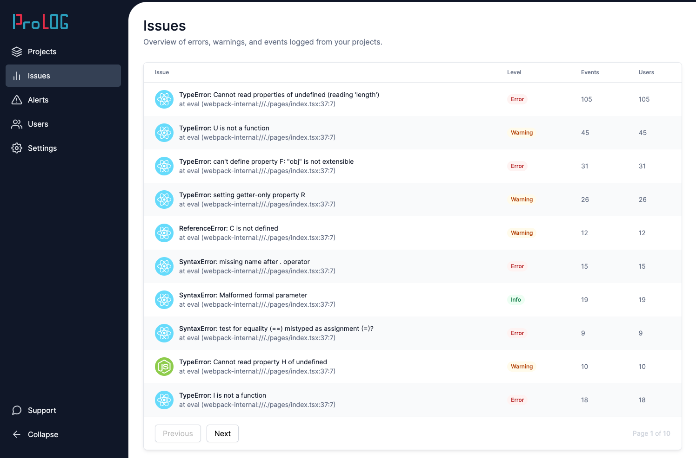

This repository is part of the [React Job Simulator](https://profy.dev) where you work in a professional dev environment with advanced tooling and workflows. You implement tasks based on designs starting from small bug fixes to full-blown features.

## The Application

The application is an error logging and monitoring tool similar to Sentry or Rollbar. You can find a deployed version of the main branch at [prolog.profy.dev](https://prolog.profy.dev). Note: you have to click the "Dashboard" link in the upper right corner to see the app as shown in the screenshot below.




## Getting Started

This project is built with Next.js, TypeScript, Cypress & styled-components among others.

```bash
npm install
```

Then run the development server:

```bash
npm run dev
```

Now you can open [http://localhost:3000](http://localhost:3000) with your browser to see the application.

## Tests

This project is covered with Cypress tests.


To run the Cypress tests on your local machine use this command:

```bash
npm run cypress
```

## Storybook

Storybook is a great tool to document your components and visually test them in isolation. To open Storybook run

```bash
npm run storybook
```
